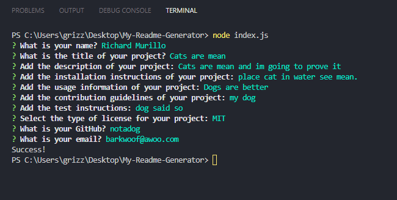
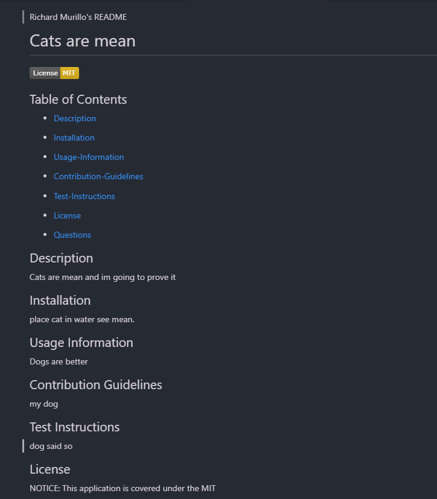

Richard Murillo's README

 # My README Generator

## Table of Contents

 * [Description](#description)

 * [Installation](#installation)

 * [Usage-Information](#usage-information)

 * [Contribution-Guidelines](#contribution-guidelines)

 * [Test-Instructions](#test-instructions)

 * [License](#license)

 * [Questions](#questions)

## Description

Created using node.js to generate professional README.md docs from the command line, and aims to cut down on the amount of time developers are using to write their README.md files. This way more of their time can be devoted to creating, maintaining, and updating their applications.

## Installation

Clone the repo: https://github.com/RichMur84/The-Logo-Maker-.git

## Usage Information

Use VS Code. Open in terminal, install node.js Once installed use command npm init -y to initialize and create a package where project files will be stored. Then command npm i inquirer. When installed run node index.js in terminal and answer the questions.
 
 
 

## Contribution Guidelines

Open for suggestions and questions by submitting and waiting for approval in github.

## Test Instructions

Features of this application include the users ability to generate a professional README.md document straight from the command line. The user will answer a series of prompts about their application, and then a README.md markdown file will be generated.
 
https://drive.google.com/file/d/159UnPZp-P5v_tvlSkbCZ6Y_whxSHPOtM/view

## License

NOTICE: This application is covered under the MIT

## Questions

Have additional questions? Click the links below to reach me through my GitHub account or Email address.

[Link to Github](https://github.com/RichMur84)

<a href="mailto:grizzlylbc1@gmail.com">grizzlylbc1@gmail.com</a>

